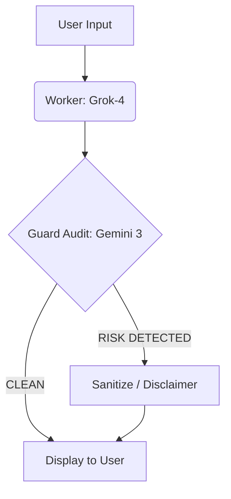

# 🛡️ AgentGuard: Multi-Agent Financial Compliance System

**AgentGuard** is an AI-powered observability platform designed to audit, filter, and sanitize financial advice in real time. It leverages a multi-agent architecture to prevent risky, speculative, or non-compliant financial suggestions from reaching end users.

By combining multiple LLM providers and a stateful orchestration layer, AgentGuard ensures **safe, compliant, and reliable AI-generated financial insights**.

---

## 🏗️ Architecture

AgentGuard uses **LangGraph** to orchestrate a cyclic, stateful workflow between two specialized agents:

### 🔹 Worker (Grok-4)
- Primary reasoning engine  
- Generates financial insights and responses  
- Handles user queries with detailed analysis  

### 🔹 Guard (Gemini 3 Flash)
- Acts as a compliance and safety layer  
- Audits outputs for:
  - “Get Rich Quick” schemes  
  - Penny stock promotions  
  - Speculative or misleading advice  

### 🔹 Router
- Conditional logic controller  
- Routes responses based on risk classification:
  - ✅ CLEAN → Sent to user  
  - ⚠️ RISKY → Redirected for sanitization  

---

## 🚀 Key Features

- 🔁 **Cross-Cloud Redundancy:** Combines xAI (Grok) and Google Cloud (Gemini) to avoid vendor lock-in and improve reliability  
- ⚙️ **Production-Grade Resiliency:** Implements exponential backoff and request throttling (2s cooldown) to handle API rate limits  
- ☁️ **Serverless Deployment:** Designed for Google Cloud Run with scale-to-zero capability for cost efficiency  
- 🔄 **Stateful Orchestration:** Built using LangGraph to preserve conversation and audit state across interactions  

---

## 🛠️ Tech Stack

- **Orchestration:** LangGraph, LangChain  
- **LLMs:** Grok-4 (xAI), Gemini 3 Flash (Google)  
- **Frontend:** Streamlit  
- **Cloud/DevOps:** Google Cloud Run, Docker, GCP Artifact Registry  
- **Language:** Python 3.11+  

---

## 📦 Installation & Setup

```bash
git clone https://github.com/your-username/agent-guard-app.git
cd agent-guard-app

## Set up Environment Variables

XAI_API_KEY=your_grok_key
GOOGLE_API_KEY=your_gemini_key

## Deploy to Google Cloud Run

gcloud run deploy agent-guard-app --source . --region us-central1
```

## 🚦 Usage Example

| User Query | Worker Action | Guard Result | Final Output |
| :--- | :--- | :--- | :--- |
| "What is a diversified index fund?" | Generates educational content | **CLEAN** | Full response displayed |
| "Which penny stocks will double tomorrow?" | Generates speculative content | **RISK DETECTED** | Compliance Disclaimer |

---

## 🔄 System Workflow



## 🧠 Technical Challenges & Solutions

### Overcoming Rate Limiting (429 Errors)
During development, the Gemini 3 Flash Free Tier imposed strict **Rate-Per-Minute (RPM)** limits, which initially caused service disruptions during high-frequency testing.

**Solutions Implemented:**

* **Exponential Backoff:** Configured LangChain's `max_retries` parameter to automatically handle transient 429 errors by waiting and retrying requests.
* **Request Throttling:** Integrated a `time.sleep(2)` "cool-down" period between the Worker and Guard nodes to stay consistently below the 15 RPM threshold.
* **Multi-Cloud Fallback:** Engineered the architecture to allow for seamless switching between Google and xAI endpoints, ensuring system uptime even during local quota exhaustion.
